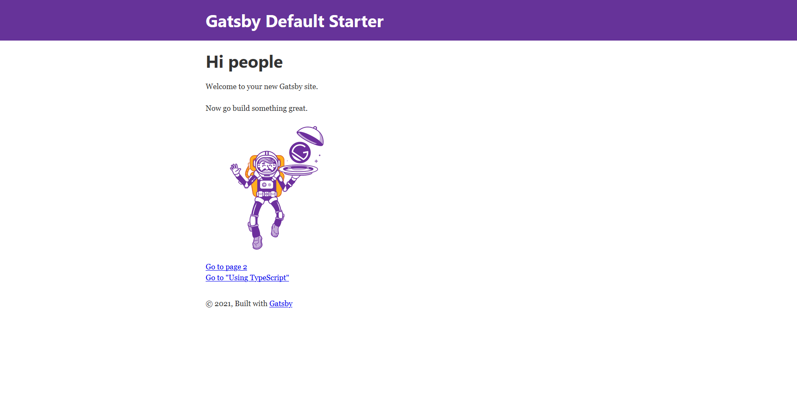
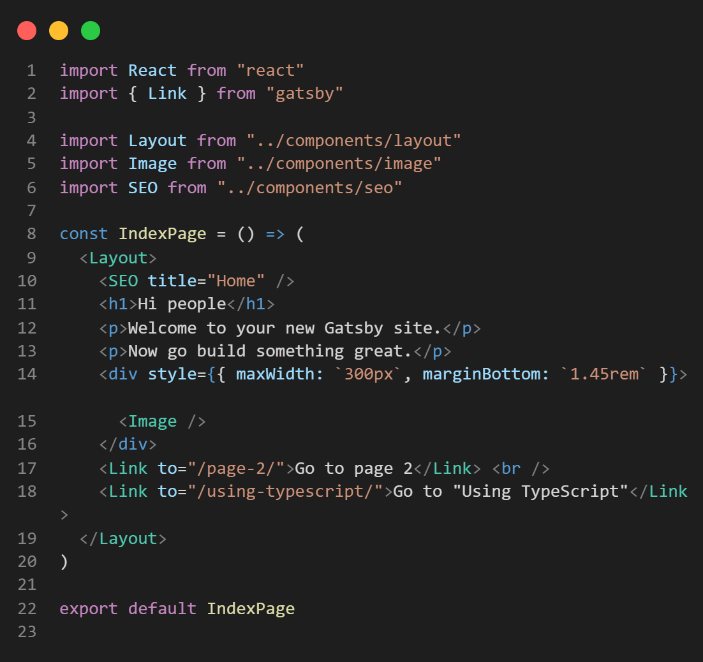

## GatsbyJS

*********************************

Gatsby is a fast, easy to use JavaScript framework, specifically for making static sites. It is built on React and before I built this site I had never touched JavaScript or React. I want to share my experience and some tips Ive learned along the way. Also check out [this GatsbyJS showcase](https://www.gatsbyjs.com/showcase/)

### Getting Started

*********************************
The best way to make a gatsby site in my opinon is to start with the default to learn how each of the components work.
To get the default gatsby site working make sure NodeJS is installed then run this in a terminal (Windows PowerShell):

1. `npm install -g gatsby-cli`
2. `gatsby new new-gatsby-site`
3. `cd new-gatsby-site`

After this you should have a new repository named `new-gatsby-site`. Now run `gatsby develop` and navigate to [http://localhost:8000](http://localhost:8000) in your chosen browser, you should see the following:

If you see this screen congratulations, you have successfully started a gatsby development environment with a working website. Now you probably want to make it look like your own, to start I would suggest getting familiar with what is happening in each of the default page files. Here is the code for the home page.

If you have never used React or JavaScript before, this might look confusing but allow me to explain. In this file we have a React component called `IndexPage` that is being exported, and since it is in the pages sub-directory it will use the exported React component to create a page with the domain route the same as the file name (with the index file being the home page). A react component can do a lot of things but in this simple example we are using it to just export JSX which is a different syntax of JavaScript that uses HTML tags

The first thing we have are the imports, we start with a React import because that is what we are using to construct the `IndexPage` component. Then we have a Link import from gatsby, this is just a useful react component for linking between pages on your site (it is not for external links, you will get a warning if you use if for that reason just use an a tag instead. E.g ``). The last three imports are other React components that are reused in multiple places, so they are in the `components` sub-directory.
